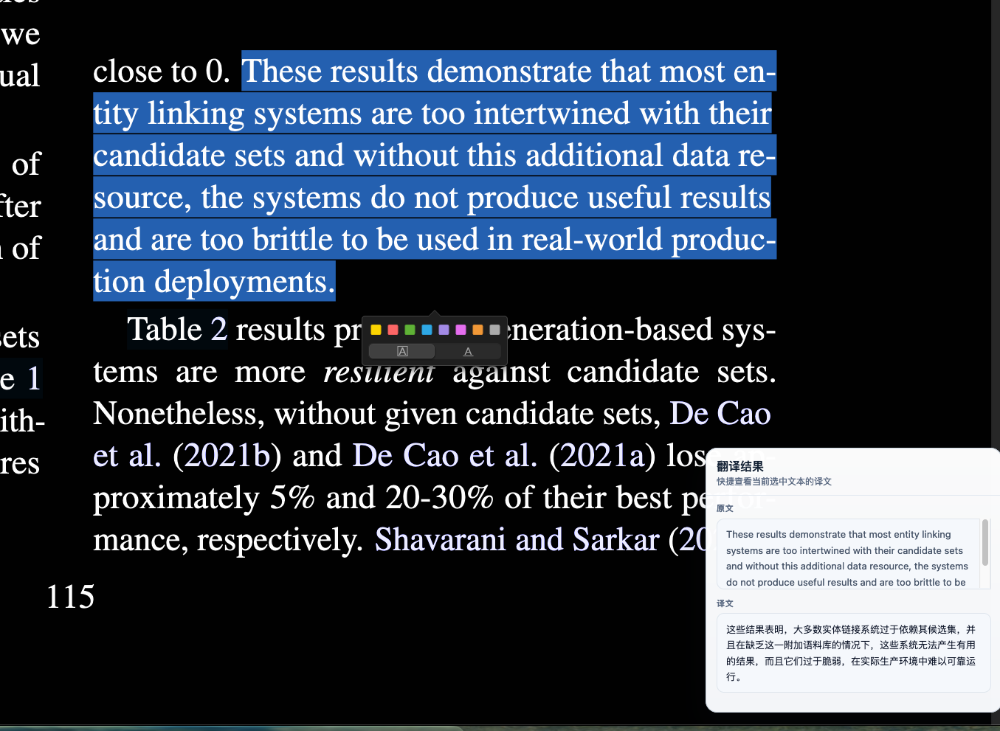

# Zotero Translate

轻量、可拖动的 Zotero 7 PDF 划词翻译插件。

选中文本后按快捷键即可翻译，支持 `OpenAI Compatible / LLM`、`DeepL`、`LibreTranslate`，并内置多种常用 API 预设。



## Features

- 面向 `Zotero 7` 的 PDF 选中文本翻译
- 默认快捷键 `Mod+T`，可在设置页自定义
- 支持多种翻译后端
- `OpenAI Compatible / LLM`
- `DeepL`
- `LibreTranslate`
- 内置常用接口预设
- `Ollama`
- `OpenAI`
- `DeepSeek`
- `OpenRouter`
- `SiliconFlow`
- `Groq`
- `DeepL Free / Pro`
- 可拖动的翻译面板，默认显示在右下角
- 支持复制译文、重新翻译、右键关闭

## Preview

插件交互分成两部分：

1. 在 Zotero PDF 阅读器中选中文本
2. 按下快捷键打开翻译面板

翻译面板默认显示：

- 原文摘要
- 译文正文
- 复制译文
- 重新翻译
- 关闭

## Install

### Direct Download

当前版本 `.xpi` 可直接下载：

- `https://github.com/Playitcooool/zotero-translate-plugin/releases/latest/download/zotero-translate.xpi`

发布页：

- `https://github.com/Playitcooool/zotero-translate-plugin/releases`

说明：

- 直链使用 GitHub 常见的 `releases/latest/download/<asset>` 形式
- 每次发布请上传同名资产 `zotero-translate.xpi`，这样 README 无需随版本改动

### From Source

```bash
npm install
npm run build
```

构建完成后安装生成的 `.xpi` 插件包。

### In Zotero

1. 打开 Zotero
2. 进入 `Tools -> Plugins`
3. 选择右上角设置按钮
4. 选择 `Install Add-on From File...`
5. 安装构建生成的 `.xpi`

## Usage

1. 在 Zotero 中打开 PDF
2. 选中需要翻译的文本
3. 按下快捷键，默认是 `Mod+T`
4. 在右下角翻译面板中查看结果

## Providers

### OpenAI Compatible / LLM

适合以下场景：

- 本地 `Ollama`
- `OpenAI`
- `DeepSeek`
- `OpenRouter`
- `SiliconFlow`
- `Groq`
- 任意兼容 OpenAI Chat Completions 的接口

需要配置：

- `API 地址`
- `API Key`
- `模型名称`
- `Prompt 模板`

默认 Prompt 会强制模型只输出译文，不添加解释或额外说明。

### DeepL

适合追求传统翻译质量和稳定性的用户。

需要配置：

- `DeepL Free` 或 `DeepL Pro`
- `API Key`

### LibreTranslate

适合想使用开源翻译服务或自托管实例的用户。

需要配置：

- `LibreTranslate` 接口地址
- 可选 `API Key`

## Settings

插件设置页支持：

- 翻译引擎切换
- 接口预设切换
- API 地址配置
- API Key 配置
- 模型名称配置
- 目标语言配置
- Prompt 模板配置
- 快捷键配置

当你切换不同翻译引擎时，设置页会自动隐藏不适用的字段。

快捷键说明：

- `Mod` 在 macOS 下等于 `Cmd`
- `Mod` 在 Windows / Linux 下等于 `Ctrl`
- 推荐写法：`Mod+T`、`Mod+Shift+T`

## Compatibility

- 主要面向 `Zotero 7`
- 已按桌面端 `macOS / Windows / Linux` 的快捷键习惯做统一处理
- 当前版本依赖 Zotero Reader 的文本选区事件
- 对更高主版本 Zotero 的兼容性暂未做完整验证

## Development

```bash
npm install
npm run watch
```

手动打包：

```bash
npm run build
```

## Project Structure

```text
addon/
  chrome/content/preferences.xhtml   # 设置页
  bootstrap.js                       # 插件启动入口
src/
  background/llm-client.ts           # 多翻译后端分发
  background/settings-manager.ts     # 插件设置存储
  index.ts                           # 快捷键、选区缓存、翻译面板
typings/
  prefs.d.ts                         # 偏好设置类型声明
```

## Notes

- 翻译触发依赖 Zotero Reader 的文本选区事件
- 如果切换了接口预设，建议重新检查 `API 地址`、`API Key`、`模型名称`

## License

MIT
